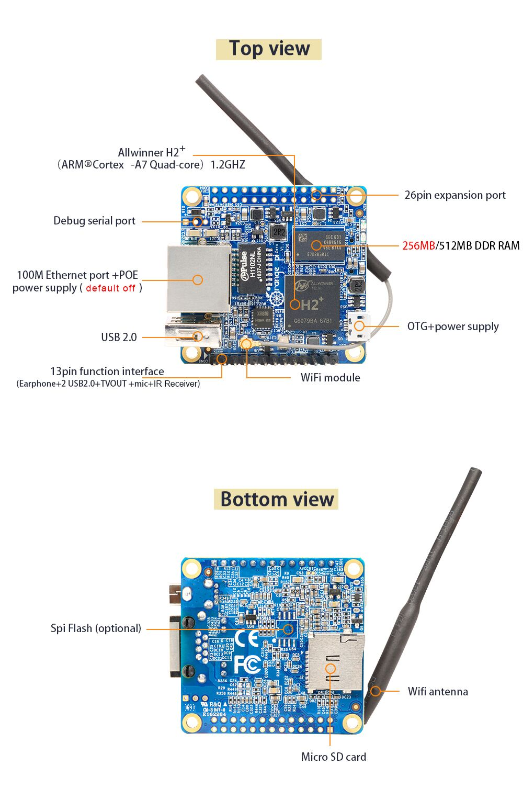

# Orange Pi Zero Black

[](https://travis-ci.org/BrightAgrotech/nerves_system_orangepi_zero)

This is the base Nerves System configuration for the [Orange P Zero](http://www.orangepi.org/orangepizero/).


<br><sup>[Image credit](#orangepi)</sup>

| Feature        | Description                                                               |
|:---------------|:--------------------------------------------------------------------------|
| CPU            | H2 Quad-core Cortex-A7 H.265/HEVC 1080P.                                  |
| GPU            | Mali400MP2 GPU @600MHz (OpenGL ES 2.0)                                    |
| Memory         | 256MB/512MB DDR3 SDRAM(Share with GPU)(256MB version is Standard version) |
| Storage        | TF card (Max. 64GB)/ NOR Flash(2MB Default not posted)                    |
| Linux kernel   | 4.10 w/ sun8i emac patches                                                |
| IEx terminal   | ttyS0 via the FTDI connector                                              |
| GPIO, I2C, SPI | Yes - Elixir ALE                                                          |
| ADC            | Yes                                                                       |
| PWM            | WIP - Yes, but no Elixir support                                          |
| UART           | ttyS0 + more via device tree overlay                                      |
| Camera         | None                                                                      |
| Ethernet       | Yes                                                                       |
| WiFi           | WIP - Linux mainline driver support is poor for the XR819 chipset         |


## Preparing your Orange Pi Zero

The Orange Pi Zero hardware is configured to always try the
eMMC Flash first when looking for software. If you have a new Orange Pi Zero,
it will boot to Debian even if a MicroSD card is inserted with good
software. To boot from the MicroSD card, hold down the USER button and
apply power.

TODO: Edit appropriately for Nano Pi vs BeagleBone

> When starting with Nerves, you will find that booting
from a MicroSD card is convenient since you can easily recover
from broken software images. Holding down the USER button will get
old. To force the Orange Pi Zero to boot
from the MicroSD card, simply corrupt the image on the eMMC memory.

> Don't worry, the Orange Pi Zero website has instructions for restoring
Debian.

From Debian:
```
debian@nanopi:~$ sudo dd if=/dev/zero of=/dev/mmcblk0 bs=1M count=100
100+0 records in
100+0 records out
104857600 bytes (105 MB) copied, 5.72098 s, 18.3 MB/s
debian@nanopi:~$ sudo reboot
```

When it reboots, it will boot from the MicroSD slot. If a MicroSD card hasn't
been inserted or if there are errors reading it, you will see the letter `C` printed
repeatedly on the console port.

## Console access

The console is configured to output to `ttyS0` by default. This is the
UART output accessible by the 6 pin header labeled J1. A 3.3V FTDI
cable is needed to access the output.

The HDMI output has been disabled via device tree to free up pins on the
GPIO header. If you would like console access via HDMI, you will need
to enable HDMI support in the Linux kernel, remove the HDMI disable
argument in the uboot script providing kernel arguments, and change
`erlinit.conf` to output to `tty1`.

## Linux versions


## Device tree overlays


### SPI

The following examples shows how to get SPI0 functional in Elixir.

Load the overlay, configure the pins, and load the device drivers:

> Note: The order of the above stops is important. The overlay must be loaded and the pins configured before writing "BB-SPIDEV0".

```console
iex(demo@nerves-0099)1> :os.cmd('config-pin overlay cape-universaln')
'Loading cape-universaln overlay\n'
iex(demo@nerves-0099)2> [17,18,21,22] |> Enum.each(&(:os.cmd('config-pin -a  P9_#{&1} spi')))
:ok
iex(demo@nerves-0099)3> File.write("/sys/devices/platform/bone_capemgr/slots","BB-SPIDEV0")
{:error, :eexist}
```

Verify that the device drivers are loaded and read spi0 transfers:

```console
iex(demo@nerves-0099)4> ls "/dev"
  ...
        spidev1.0              spidev1.1              spidev2.0              spidev2.1
  ...
iex(demo@nerves-0099)5> File.read "/sys/bus/spi/devices/spi1.0/statistics/transfers"
{:ok, "0"}
```

Verify that the pins are configured:

```console
iex(demo@nerves-0099)6> [17,18,21,22] |> Enum.map(&(:os.cmd('config-pin -q  P9_#{&1} spi')))
['P9_17 Mode: spi\n', 'P9_18 Mode: spi\n', 'P9_21 Mode: spi\n', 'P9_22 Mode: spi\n']
```

If you have included [ElixirAle](https://github.com/fhunleth/elixir_ale) as a dependency, you can start it now and test a transfer:

> The example below should work without any additional hardware connected to the NPN. If you have SPI hardware connected to the NPN, your returned binary might be different.

```console
iex(demo@nerves-0099)7> Spi.start_link "spidev1.0", [], name: :spi0
{:ok, #PID<0.181.0>}
iex(demo@nerves-0099)8> Spi.transfer :spi0, <<1,2,3,4>>
<<255, 255, 255, 255>>
```

> Note: If you get back all 0's, then you have likely have not configured the overlay pins correctly.

## Supported USB WiFi devices

The base image includes drivers and firmware for Ralink RT53xx
(`rt2800usb` driver) and RealTek RTL8712U (`r8712u` driver) devices.


## Installation

If [available in Hex](https://hex.pm/docs/publish), the package can be installed as:

  1. Add nerves_system_orangepi_zero to your list of dependencies in `mix.exs`:

        def deps do
          [{:nerves_system_orangepi_zero, "~> 0.1.0"}]
        end

  2. Ensure nerves_system_orangepi_zero is started before your application:

        def application do
          [applications: [:nerves_system_orangepi_zero]]
        end


[Image credit](#fritzing): This image is from the [Fritzing](http://fritzing.org/home/) parts library.
